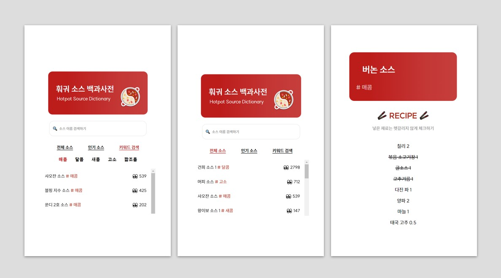

# 훠궈 소스 백과사전
 

  
   
   
    
   
     
   </img>

 

🔗 https://hotpot-8c321.web.app/
- 다양한 훠궈 소스 레시피를 한 곳에서 모아볼 수 있습니다.
- 전체 목록, 인기 소스, 키워드 검색을 통해 자신에게 맞는 훠궈 소스 레시피를 찾아볼 수 있습니다.
- 레시피 상세 화면에서는 이미 넣은 소스는 체크하여 헷갈리지 않게 소스를 제조할 수 있습니다.

 

## 개발일지
1️⃣ [하이디라오 훠궈 소스 백과사전](https://inner-stella.tistory.com/entry/%EA%B0%9C%EB%B0%9C%EC%9D%BC%EC%A7%80-%ED%95%98%EC%9D%B4%EB%94%94%EB%9D%BC%EC%98%A4-%ED%9B%A0%EA%B6%88-%EC%86%8C%EC%8A%A4-%EB%B0%B1%EA%B3%BC%EC%82%AC%EC%A0%84)
